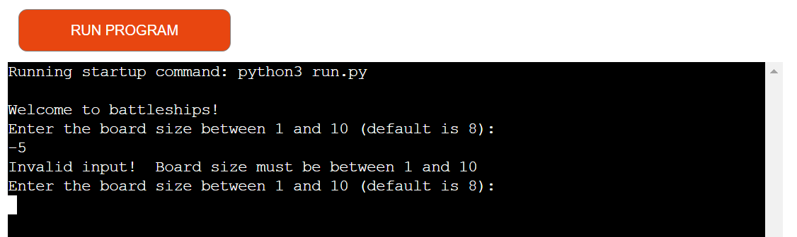
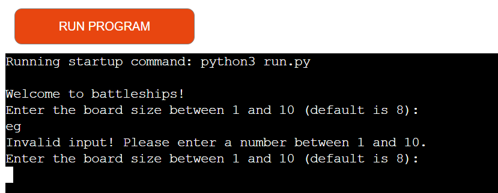
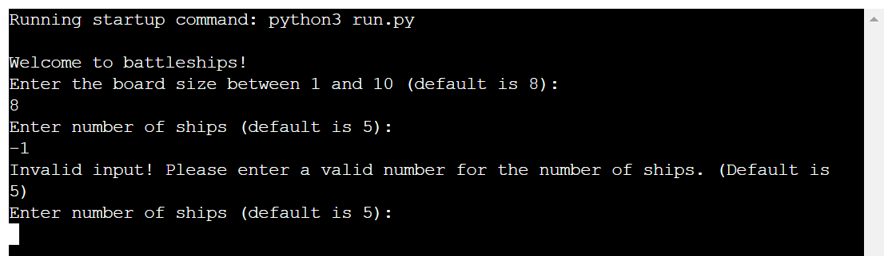
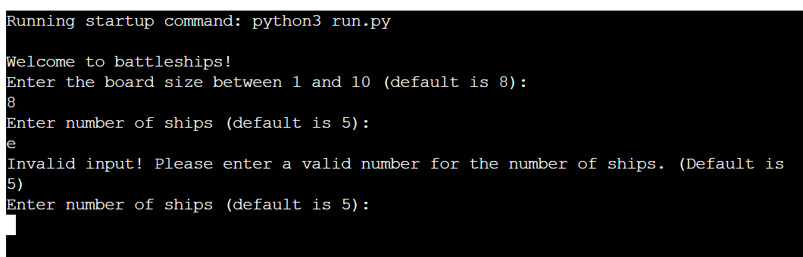
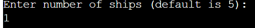
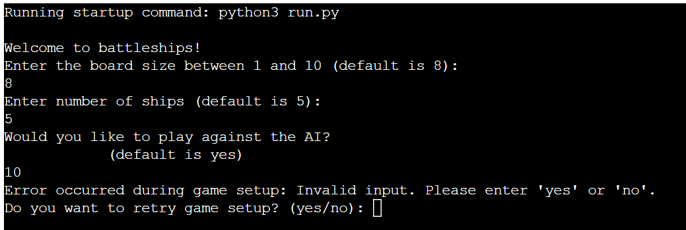
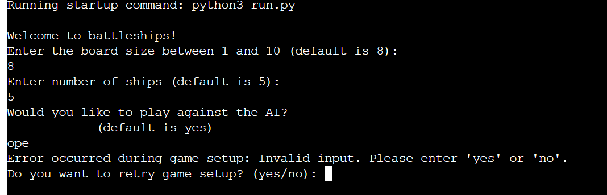

# Battle-fleets

## Description
Battle-fleets is a classic battleship game designed to provide users with an engaging and enjoyable gaming experience. Whether you're a seasoned player or new to the game, Battle-fleets offers a fun way to challenge your strategic skills against either an AI opponent or another player.

[Play Battle-fleets](https://ciproject3-1a2d8b8a54cb.herokuapp.com/)

## Table of Contents
1. [Introduction](#introduction)
2. [Benefits of battle-fleets](#benefits-of-battle-fleets)
3. [Design](#design)
4. [Features](#features)
5. [Testing](#testing)
6. [Exception handling](#exceptions)
7. [Deployment](#deployment)
8. [Bugs and Fixes](#bugs-and-fixes)
9. [Resubmission Requirements and Completions](#resubmission-requirements-and-completions)
10. [Value to End Users](#value-to-end-users)
11. [PEP8 Validator](#pep8-validator)
12. [Sources and Credits](#sources-and-credits)

## Introduction
Battle-fleets is a web-based battleship game that offers single-player and two-player modes, customizable settings, and real-time feedback. This README provides an overview of the project's design, features, testing, deployment process, bug fixes, and sources.

## Benefits of Battle-fleets

### 1. Entertainment and Engagement
Battle-fleets offers users an entertaining and engaging gaming experience. Whether playing solo against the AI or competing with friends, users can enjoy hours of strategic gameplay.

### 2. Cognitive Skills Enhancement
Playing Battle-fleets requires strategic thinking, planning, and decision-making skills. Users can enhance their cognitive abilities by strategizing ship placements, predicting opponents' moves, and adapting to changing game dynamics.

### 3. Customizable Settings
The game's customizable settings allow users to tailor their gaming experience according to their preferences. From adjusting board size to selecting difficulty levels, users have control over various aspects of the game to suit their preferences and skill levels.

### 4. Real-time Feedback
Battle-fleets provides real-time feedback on gameplay, including hits, misses, and game progress. This immediate feedback loop keeps users informed about their performance and enables them to adjust their strategies accordingly.

### 5. Social Interaction
With the option for two-player mode, Battle-fleets encourages social interaction and friendly competition among users. Whether playing with friends or challenging opponents online, users can enjoy a shared gaming experience and strengthen social connections.

### 6. Continuous Improvement
As users engage in multiple game sessions, they have the opportunity to improve their skills and strategies over time. Whether aiming to beat their own high scores or climb the global leaderboard, Battle-fleets motivates users to strive for continuous improvement and mastery of the game.

### 7. Accessibility
As a web-based game, Battle-fleets offers accessibility across various devices and platforms with an internet connection. Users can enjoy the game on desktops, laptops, tablets, or smartphones, making it convenient to play anytime, anywhere.

### 8. Stress Relief
Gaming can serve as a stress-relieving activity, providing users with a temporary escape from daily pressures and challenges. Battle-fleets offers a fun and immersive experience that can help users unwind and relax after a long day.

Overall, Battle-fleets not only provides entertainment but also offers several benefits for users, including cognitive stimulation, social interaction, customization options, and accessibility. Whether seeking mental challenge, social engagement, or simple enjoyment, Battle-fleets caters to a diverse range of preferences and gaming interests.

## Design
The design of Battle-fleets focuses on simplicity, intuitiveness, and visual appeal. The game interface is designed to be easy to navigate, with clear instructions and feedback to guide the player through each step of the game.

## Features
### Key Features:
- **Player vs AI:** Challenge the computer in a single-player mode.
- **Player vs Player:** Compete against a friend in a two-player mode.
- **Customizable Settings:** Adjust game parameters such as board size and ship placement.
- **Real-time Feedback:** Receive immediate feedback on hits, misses, and game progress.
- **Score Tracking:** Keep track of scores and performance over multiple game sessions.

### Future Features (Planned):
- **Online Multiplayer:** Enable online multiplayer functionality for users to play against friends or random opponents.
- **Advanced AI:** Implement more sophisticated AI algorithms to provide a more challenging opponent.
- **Leaderboard:** Introduce a global leaderboard to track high scores and player rankings.
- **Customizable Themes:** Allow users to customize the game's appearance with different themes and backgrounds.

## Testing
### Browser Testing:
Battle-fleets has been extensively tested on various web browsers including Chrome, Firefox, Safari, Ecosia, and Edge to ensure compatibility and optimal performance across different platforms.

| Browser | Layout + Functionality |
|---------|------------------------|
| Chrome  | ✔                      |
| Firefox | ✔                      |
| Safari  | ✔                      |
| Ecosia  | ✔                      |
| Edge    | ✔                      |

### Manual Testing:
- Checked for correct ship placement and alignment.
- Verified AI behavior and difficulty levels.
- Ensured proper handling of user input and error messages.

## Exception handling
The code implements several 'try except' blocks to catch any erroneous or invalid inputs which the end user could accidentally input.

- These first 2 screenshots are about the input for the board size.

This first screenshot shows an error of when someone has tried to enter a number thats less than 0 which causes the program to force the user to re-enter their input. This error message is caused by a try-except block of code within the main program.

This second screenshot shows an error of inputing letters instead of a number which causes the program to force the user to re-enter their input. This error message is caused by a try-except block of code within the main program.

These next 2 screenshots are about the input for the number of ships which should be an integer and what happens if the end users input anything which could cause errors such as letters or erroneous inputs or even just human error.

This first screenshot shows an error message when the end user inputs a number less than 0 which causes the program to force the user to re-enter their input. This error message is caused by a try-except block of code within the main program.

This second screenshot shows an error message of the user who inputed a letter or a string of letters which also forces the user to re-enter their input as a number.

This screenshot shows the input for the number of ships when the end user inputs a valid integer which does not cause the program to crash or cause them to re-input a valid integer
### AI error handling
These screenshots are showing the errors and correct input for picking if the user wants to play against the AI and what happens if the end user accidentally causes any errors.

This screenshot (as seen above), shows what happens if the end user types in numbers (integers) rather than yes or no.
It causes a different function to make the users go through the first 3 questions again to try to get a valid input.

This screenshot shows what happens if the end user types in a string which is not yes or no. It causes a different function to make the users go through the first 3 questions again to try to get a valid input.
## Deployment
Battle-fleets was deployed via Heroku following these steps:
1. Create requirements.txt.
2. Push to GitHub.
3. Sign up/login to Heroku.
4. Create a new app.
5. Set up configuration variables.
6. Add Python and Node.js buildpacks.
7. Connect GitHub repository.
8. Choose deployment method (manual or automatic).
9. Wait for Heroku to build the application.
10. Open the app and enjoy!

## Bugs and Fixes
Several bugs were identified and fixed during development:
- Invalid Syntax on line 241: Separated the parameter into different lines.
- 'DataFrame' object has no attribute 'append': Changed lines 30 and 31 to correct the append attribute.
- Error occurred during gameplay: empty range in randrange(0, -1): Fixed the randrange issue but need further testing.
- Error loading scoreboard module 'pandas' has no attribute 'read': Fixed the attribute error by separating onto different lines.
- Error occurred during gameplay: name 'dsplay_leaderboard' is not defined: Corrected the function name.
- Error occurred during gameplay: 'BattleshipGame' object has no attribute 'display_leaderboard': Unindented lines 27-35.
- Error occurred during gameplay: 'BattleshipGame' object has no attribute 'exit_game': Changed `exit_game` to `exit_function`.
- SyntaxError 'break' outside loop on line 127: Fixed the indentation.
- NameError: name 'main()' is not defined: Defined the 'main()' function.

## Resubmission Requirements and Completions
This is the first resubmission attempt, focusing on improving the following areas:
- Improved exception handling for invalid inputs.
- Enhanced organization and clarity of the README.
- Added screenshots and value proposition for users.
- Documented PEP8 validation results.

## Value to End Users
Battle-fleets provides a sense of enjoyment and challenges the strategic skills and patience of users against a computer program or other players. With customizable settings and real-time feedback, users can immerse themselves in an engaging gaming experience.

## PEP8 Validator
The Python code has been formatted according to the PEP8 style guide. No errors or warnings were found during validation.

## Sources and Credits
- Code Institute's GitHub repository for providing the project template and guidance.
- Spencer Barriball for mentorship and support.
- Pylint for code formatting.
- Code Institute's Python tester for error checking.
